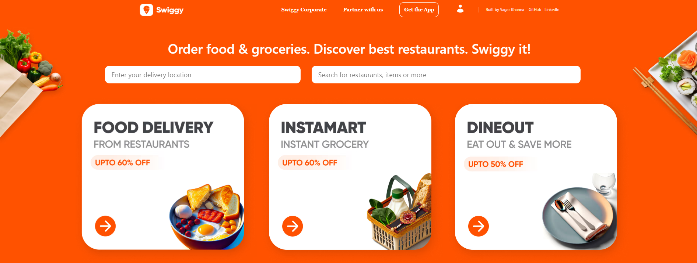
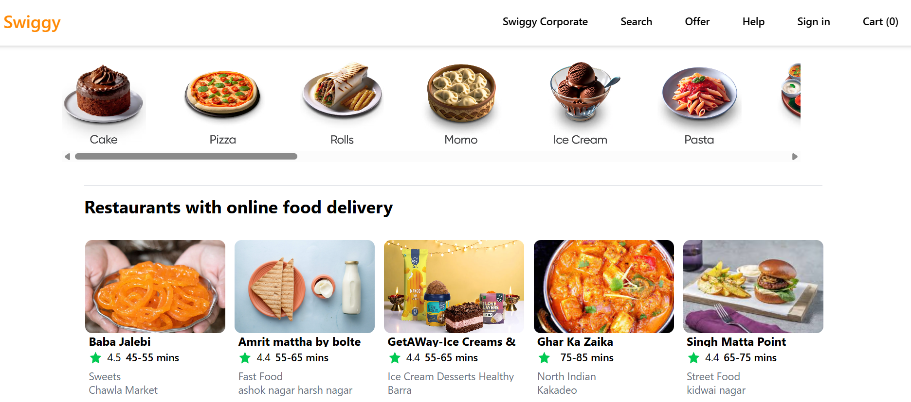
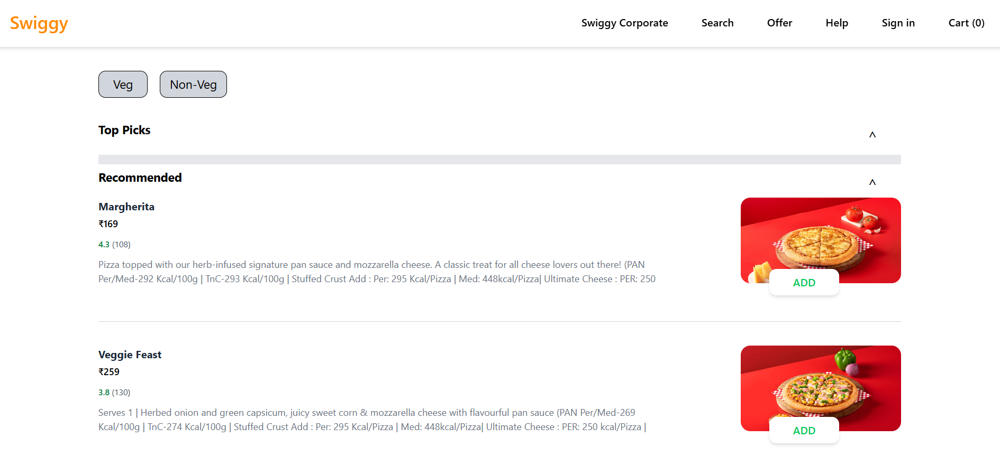
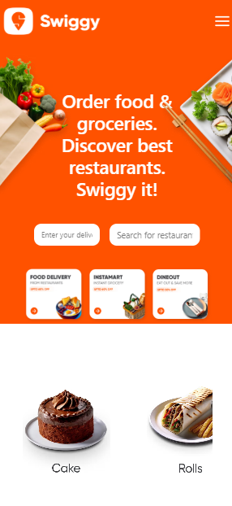
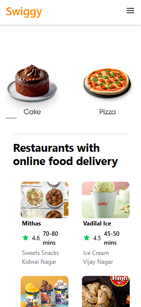
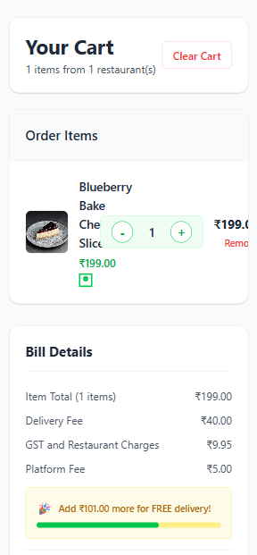
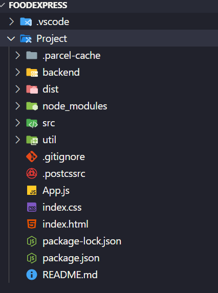
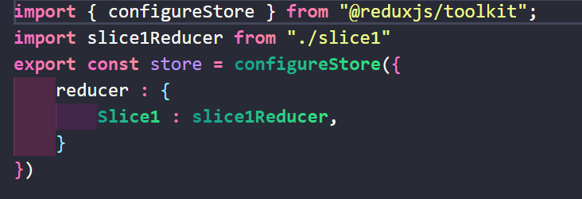

# 🍔 FoodExpress - Food Delivery App

A modern, full-stack food delivery application built with React, Redux, and Node.js, inspired by Swiggy.


## 🌐 Live Demo
- **Frontend:** https://foodexpress-online.netlify.app
- **Backend API:** https://foodexpress-backend-bleh.onrender.com

## 🚀 Features

### Frontend Features
- **🏠 Home Page** - Restaurant listings with search and filters
- **🍽️ Restaurant Menu** - Detailed menu with add to cart functionality
- **🛒 Shopping Cart** - Add/remove items with real-time price calculation
- **🔍 Search & Filters** - Find restaurants by cuisine, rating, and location
- **💳 Checkout System** - Complete order flow
- **🎨 Responsive UI** - Works on all devices
- **⚡ Shimmer Effects** - Loading animations for better UX

### Backend Features
- **RESTful API** - Clean API endpoints
- **Data Management** - Mock data for restaurants and menu items
- **Scalable Architecture** - Ready for database integration

## 📁 Project Structure
[FoodExpress]/
├── 📁 backend/ # Node.js Express Server
│ ├── server.js # Main server file
│ ├── package.json # Backend dependencies
│ └── node_modules/
├── 📁 src/ # React Frontend
│ ├── 📁 Assets/ # Images & static files
│ │ ├── swiggy_logo.png
│ │ ├── swiggy_logo_white.png
│ │ └── food-images/
│ ├── 📁 components/ # React Components
│ │ ├── 📁 NextStep/ # Main app components
│ │ │ ├── Header.js
│ │ │ ├── Home.js
│ │ │ ├── Restaurant.js
│ │ │ ├── RestCard.js
│ │ │ ├── Foodcart.js
│ │ │ └── Shimmer.js
│ │ ├── Checkout.js
│ │ ├── RestaurantMenu.js
│ │ └── SearchPage.js
│ ├── 📁 GlobalObj/ # Global utilities
│ ├── store.js # Redux store configuration
│ ├── slice1.js # Redux slices
│ ├── FoodData.js # Mock food data
│ ├── DineData.js # Restaurant data
│ └── App.js # Main App component
├── package.json # Frontend dependencies
└── README.md


## 🛠️ Technology Stack

### Frontend
- **React 19** - UI library
- **Redux Toolkit** - State management
- **CSS3** - Styling and animations
- **Parcel** - Build tool

### Backend
- **Node.js** - Runtime environment
- **Express.js** - Web framework
- **REST API** - API architecture

## 🚀 Quick Start

### Prerequisites
- Node.js (v14 or higher)
- npm or yarn

### Installation

1. **Clone the repository**
   ```bash
   git clone https://github.com/Sagarkhanna-dev
   cd FoodExpress

2. **Install Frontend Dependencies**
    cd Project
   npm install

3. **Install Backend Dependencies**
    cd Project
   cd backend
    npm install

4. **Start the Development Servers**
  **Terminal 1 - Backend Server:**  
    cd backend
    node server.js 
    **Server runs on http://localhost:3001**

  **Terminal 2 - Frontend Server:**
    cd Project
    npx parcel index.html
    **App runs on http://localhost:1234**

5. **Open your browser**
**Navigate to http://localhost:1234**


📱 Pages & Components
Core Pages
Home (/) - Restaurant listings and search

Restaurant (/restaurant/:id) - Menu and details

Cart (/cart) - Shopping cart management

Checkout (/checkout) - Order completion

Search (/search) - Advanced search

Account (/account) - User profile

Offers (/offers) - Discounts and promotions

Key Components
Header - Navigation and search bar

RestCard - Restaurant card component

FoodCart - Cart management

Shimmer - Loading skeleton

MenuCard - Individual menu items

🗂️ Data Management
{
  cart: {
    items: [],
    totalAmount: 0,
    restaurantInfo: {}
  },
  restaurants: {
    list: [],
    filteredList: [],
    loading: false
  }
}

Mock Data Files
FoodData.js - Menu items and food details

DineData.js - Restaurant information

Customization
Adding New Restaurants
Edit DineData.js to add new restaurant entries.

Adding Menu Items
Update FoodData.js with new food items and categories.

Styling
Modify component CSS files to change the appearance.

🤝 Contributing
Fork the project

Create your feature branch (git checkout -b feature/AmazingFeature)

Commit your changes (git commit -m 'Add some AmazingFeature')

Push to the branch (git push origin feature/AmazingFeature)

Open a Pull Request

📝 Future Enhancements
User authentication

Real database integration

Payment gateway integration

Real-time order tracking

Reviews and ratings

Admin dashboard

👨‍💻 Author
Sagar Khanna

GitHub: [https://github.com/Sagarkhanna-dev]

LinkedIn: [http://www.linkedin.com/in/sagar-khanna-19a739376]

### Acknowledgments
Inspired by Swiggy UI/UX

React and Redux documentation

Open source community

## 📸 Screenshots

### 🖥️ Desktop Views
| Home Page | Restaurants | Menu |
|-----------|-----------------|---------------|
|  |  |  |

### 📱 Mobile Views
| Home Page | Menu Page | Cart |
|-----------|-----------|------|
|  |  |  |

### 🔧 Technical
| Project Structure | Redux Implementation |
|-------------------|---------------------|
|  |  |
